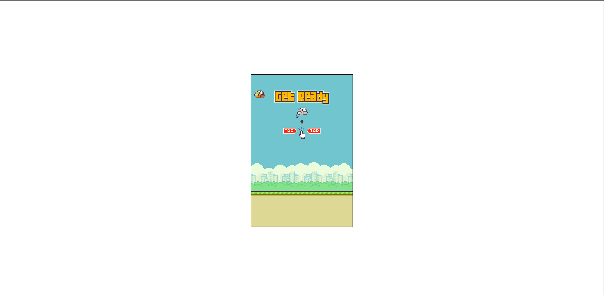

# flappyBird

<h1 align="center">Flappy Bird</h1>

Jogo criado a partir dos videos do Mairo Souto para melhorar as minhas habilidades com o JavaScript. 

  <a href="#-tecnologias">Tecnologias</a>&nbsp;&nbsp;&nbsp;|&nbsp;&nbsp;&nbsp;
  <a href="#-projeto">Projeto</a>&nbsp;&nbsp;&nbsp;|&nbsp;&nbsp;&nbsp;
  <a href="#memo-licença">Licença</a>

  

 

 
    <

## 🚀 Tecnologias

-Nesse projeto foi utilizado as seguintes tecnologias:

-CSS  
-HTML  
-JS  
-Github  

## 💻 Projeto

- [Visite o projeto online](https://helenapl145.github.io/flappyBird/)

Esse projeto está sob a licença MIT.

---

Feito com ♥ by Helena Lima
 

